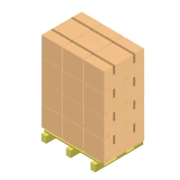
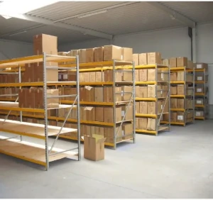

# Colis Package

Le but est de gérer le stock d'un entrepôt de colis standardisés.
Les colis sont envoyés par différents fournisseurs (commandes d'achat) et contiennent un seul code article.
La création des colis se fait après contrôle de la réception d'une commande.
Chaque type de colis contient une quantité maximale propre à chaque produit.
Un produit peut être conditionné dans un ou plusieurs types de colis.
Un colis ne contient pas obligatoirement la quantité maximale de produits.

le stockage se fait à "hauteur d'homme", de 0 à 180cm.

The aim is to manage the stock of a warehouse for standardized parcels.
The parcels are sent by different suppliers (purchase orders) and contain only one item code.
Parcel creation takes place after checking the receipt of an order.
Each type of parcel contains a maximum quantity specific to each product.
A product can be packaged in one or several types of parcels.
A parcel does not necessarily contain the maximum quantity of products.

Storage is done at "man height", from 0 to 180cm. |

Les colis existent en 4 tailles :
The packages come in 4 sizes:

| Référence colis | longueur en cm | largeur en cm | hauteur en cm | palettisable | Occupation | Stockage |
|-----------------|----------------|---------------|---------------|--------------|------------|----------|
| Package Reference | Length (cm) | Width (cm) | Height (cm) | Palletizable | Occupancy | Storage |
|-----------------|----------------|---------------|---------------|--------------|------------|----------|
| D               | 40             | 30            | 20            | oui/yes          | 1          | court/short    |
| B               | 40             | 30            | 40            | oui/yes          | 2          | court/short    |
| C               | 60             | 30            | 20            | non/no          | 1          | long     |
| A               | 60             | 30            | 40            | non/no          | 2          | long     |

palettisable : tailles et dispostions optimisées pour couvrir la surface d'une palette de type Europ (80cm x 120cm).

Palletizable : Optimized sizes and arrangements to cover the surface of a Europ pallet (80cm x 120cm).

Occupation : chaque élément de stockage est composé de 4 cellules l'une au dessus de l'autre, de taille 2 en hauteur. les colis d'occupation 1 remplissent la mointier d'une cellule et de d'occupation 2 remplissent la totalité de la cellule. La largeur et la profondeurs sont celles du colis.

Occupancy: each storage element is made up of 4 cells one above the other, size 2 in height. occupancy 1 packages fill half of a cell and occupancy 2 packages fill the entire cell. The width and depth are those of the package.

Stockage :  Défini la profondeur du rayonnage.

Storage: Defines the depth of the shelving.

